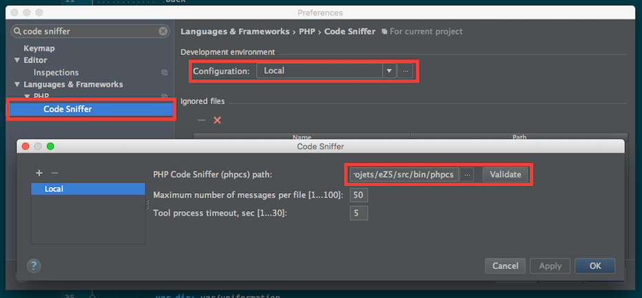
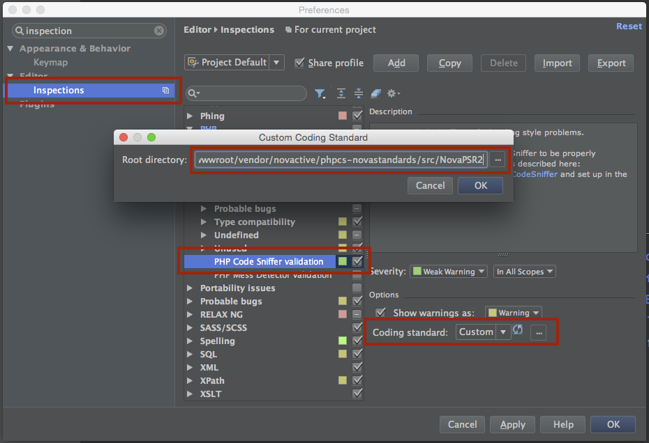

Novactive PHP_CodeSniffer custom standards
==========================================

# About

This package provides some PHP_CodeSniffer compliant coding standards, used at [Novactive](http://www.novactive.com).

# Requirements

* [PHP_CodeSniffer package](https://github.com/squizlabs/PHP_CodeSniffer)
* [PHP_CodeSniffer standard for eZ Publish, from eZ Systems](https://github.com/ezsystems/ezcs/tree/master/php)

Note: the eZ Publish standard, from eZ Systems engineering team, had to be integrated to our package, as we are relying on it for our extended eZ Publish standard (there is no smart way to extend a custom standard for now)

# Installation

## With Composer

Add the dependency to your composer.json file :

    "require-dev": {
        ...,
        "novactive/phpcs-novastandards": "~1.2"
    }

Install it :

    composer update novactive/phpcs-novastandards

# Usage

## CLI

From the sources ROOT directory of your project :

    ./vendor/bin/phpcs --standard=vendor/novactive/phpcs-novastandards/src/NovaPSR2" src

## PHPStorm

### Configure CodeSniffer

Open the PHPStorm Preferences / settings panel and go to the Code Sniffer section. You should define the value for parameter "PHP Code Sniffer (phpcs) path" for instance :

* "wwwroot/bin/phpcs" for eZ Publish
* "wwwroot/vendor/bin/phpcs" for other techno using composer
* "~/.composer/vendor/bin/phpcs" if you installed CodeSniffer globally on your system using the command:

    php composer.phar global require squizlabs/php_codesniffer

### Configure which standard to use

Open the PHPStorm Preferences / settings panel and go to the Inspections section. You should enable "PHP > PHP Code Sniffer validation" and fill in the path to required standard, for instance :

* "vendor/novactive/phpcs-novastandards/src/NovaEZ" for eZ Publish
* "vendor/novactive/phpcs-novastandards/src/NovaPSR2" for Symfony 2 and PSR2 compliant apps

# Bug and issues

The standards are still under active development. Expect bugs and "false negatives" when checking code. Feel free to report them on the [issues section](https://github.com/Novactive/phpcs-novastandards/issues).

# Credits

Thanks to :

- Squiz Labs for the [PHP_CodeSniffer package](https://github.com/squizlabs/PHP_CodeSniffer) (some native Sniffs were extended)
- the eZ Systems engineering team for their [PHP_CodeSniffer standard for eZ Publish](https://github.com/ezsystems/ezcs/tree/master/php).
